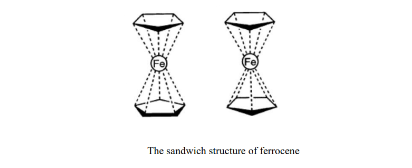
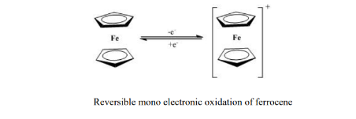

### Introduction:

Cyclic voltammetry is an electroanalytical technique. It is a valuable technique that provides vital information about the oxidation state of an element in a compound. Various inorganic
compounds contain transition metal centers with different oxidation states. When conditions provide stable redox forms during the time required to obtain a voltammogram i.e. current-
potential curve. CV is a simple and direct method for measuring a complex standard reduction potential (E°). CV helps to determine the stability of a compound under different experimental
conditions. Ferrocene is a highly investigated organometallic molecule. Bis(cyclopentadienyl)iron(II) or ferrocene, Fe(C5H5)2 has a sandwich structure with the iron
sandwiched between two cyclopentadienyl rings.The following figure represents the sandwich structure of ferrocene.  

  

It can undergo one-electron oxidation to form ferrocenium cation Fe(C5H5)2+ reversibly. Organic
and aqueous media mediums can be used to study ferrocene electrochemical behaviors.The following figure represents the reversible mono-electronic oxidation of ferrocene.  

 

The electrochemical measurements were carried out using a potentiostat equipped with a three-electrode cell configuration. A glassy carbon working electrode, a saturated calomel reference
electrode, and a platinum wire counter electrode were employed. The system provided precise control of the applied potential and current response, enabling reliable cyclic voltammetry of the
ferrocene/ferrocenium redox couple.

